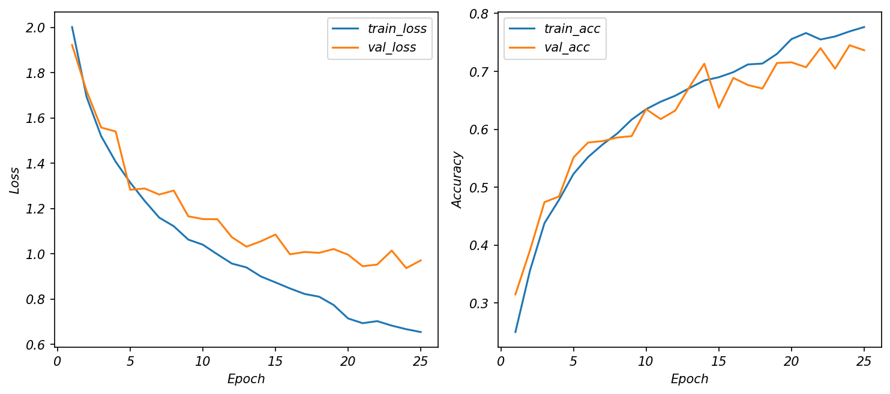
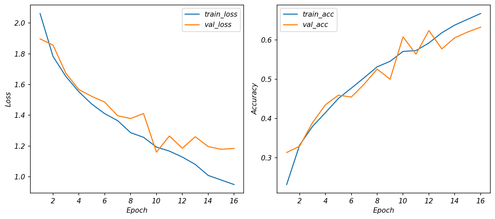
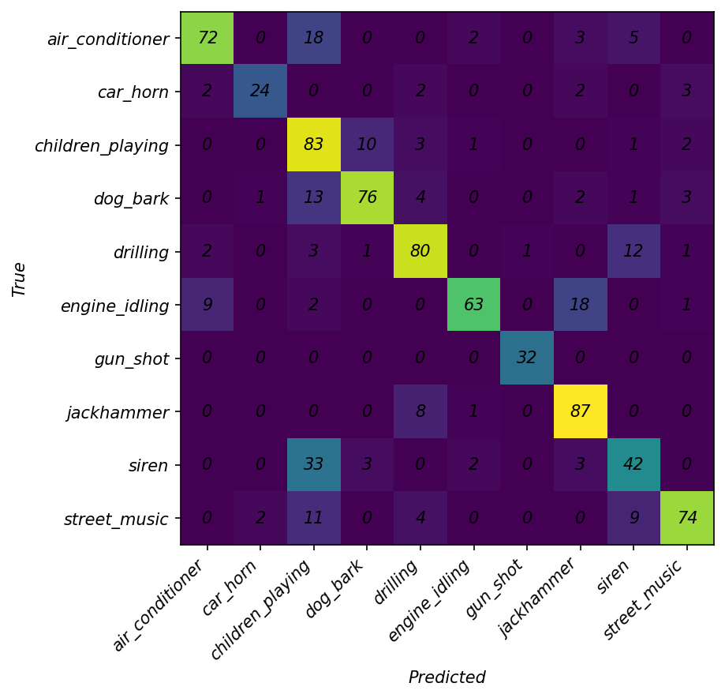
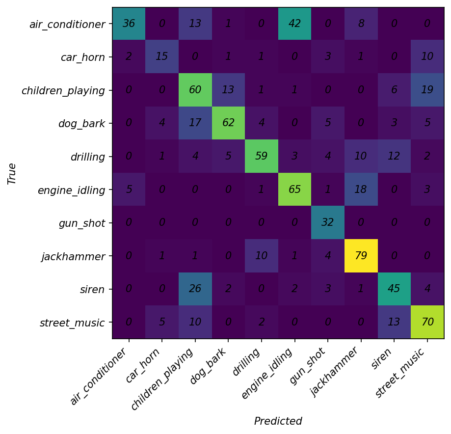

# CSC4005 Lab 4 Report – CRNN for UrbanSound8K

## 1. Thông tin sinh viên

- Họ tên: Trần Trường Giang 
- Mã sinh viên: 1671040009 
- Lớp: KHMT 16-01
- Link GitHub repo: https://github.com/FIT-DNU-CS-16-01/csc4005-lab4-trggiang0704.git
- Link W&B project: https://wandb.ai/giangtit1007-dainam-vietnam/csc4005-lab4-urbansound8k-crnn?nw=nwusergiangtit1007

# 2. Mục tiêu thí nghiệm

Lab 4 tập trung xây dựng và huấn luyện mô hình CRNN cho bài toán phân loại âm thanh UrbanSound8K sử dụng log-mel spectrogram làm đầu vào.  
Mục tiêu chính là tìm hiểu cách CNN học các pattern cục bộ trên spectrogram và cách GRU/LSTM học quan hệ thời gian giữa các đặc trưng âm thanh.  
Ngoài ra, bài lab còn đánh giá khả năng tổng quát hóa của CRNN thông qua validation/test accuracy và so sánh với mô hình 1D-CNN ở Lab 3.  
Thí nghiệm cũng phân tích learning curves, confusion matrix và ảnh hưởng của các kiến trúc RNN khác nhau như GRU và BiLSTM.

---

# 3. Cấu hình dữ liệu

| Thành phần | Giá trị |
|---|---|
| Dataset | UrbanSound8K |
| Số lớp | 10 |
| Train folds | 1–8 |
| Validation fold | 9 |
| Test fold | 10 |
| Feature | log-mel spectrogram |
| Sampling rate | 16 kHz |
| Duration | 4 giây |

---

# 4. Cấu hình mô hình

| Thành phần | Giá trị |
|---|---|
| Model | CRNN |
| CNN blocks | Conv2D + BatchNorm + ReLU + MaxPool |
| RNN type | GRU / BiLSTM |
| Hidden size | 64 |
| Dropout | 0.3 (baseline), 0.35 (extension) |
| Optimizer | AdamW |
| Learning rate | 0.001 (baseline), 0.0007 (extension) |
| Batch size | 32 |
| Epochs | 25 |

---

# 5. Kết quả huấn luyện

| Run | best_val_acc | test_acc | Ghi chú |
|---|---:|---:|---|
| logmel_crnn_gru_baseline | 0.7451 | 0.7563 | Kết quả tốt nhất, train ổn định, tổng quát hóa tốt |
| extension_bilstm_crnn | 0.6078 | 0.6249 | Train nhanh hơn nhưng accuracy thấp hơn baseline |

---

# 6. Learning curves

Nhận xét:

- Baseline CRNN-GRU có learning curves ổn định, train_loss và val_loss cùng giảm theo thời gian.
- Khoảng cách giữa train_acc và val_acc không quá lớn nên hiện tượng overfitting không quá nghiêm trọng.
- Sau epoch 19, learning rate giảm từ 0.001 xuống 0.0005 giúp validation accuracy tăng thêm.
- BiLSTM-CRNN có dấu hiệu dao động validation loss mạnh hơn và dừng sớm tại epoch 16 do early stopping.
- Early stopping giúp tránh tiếp tục train khi validation không còn cải thiện.

---

# 7. Confusion matrix

  

Nhận xét:

- Lớp `gun_shot` được phân loại tốt nhất với recall gần như hoàn hảo.
- `jackhammer` và `drilling` đôi lúc bị nhầm lẫn do đều là âm thanh cơ khí mạnh.
- `children_playing` thường bị nhầm với `street_music` hoặc `dog_bark` vì có background âm thanh phức tạp.
- `siren` là lớp khó do âm thanh thay đổi mạnh theo thời gian và dễ trộn với môi trường đô thị.
- Baseline CRNN-GRU giảm nhầm lẫn tốt hơn rõ rệt so với BiLSTM-CRNN.

---

# 8. So sánh với Lab 3 1D-CNN

| Tiêu chí | Lab 3: 1D-CNN | Lab 4: CRNN |
|---|---|---|
| Feature chính | log-mel | log-mel |
| Khả năng học pattern cục bộ | Có | Có |
| Khả năng học quan hệ thời gian | Hạn chế | Tốt hơn |
| Test accuracy | 0.5871 | 0.7563 |
| Nhận xét | Train rất nhanh, mô hình nhẹ nhưng khả năng học chuỗi thời gian còn hạn chế | Accuracy cao hơn rõ rệt, học được cả đặc trưng không gian và thời gian nhưng train lâu hơn |

---

# 9. Kết luận

CRNN-GRU cho kết quả tốt hơn đáng kể so với mô hình 1D-CNN ở Lab 3 với test accuracy đạt khoảng 75.6%.  
Mô hình học ổn định, validation accuracy tăng đều và không xuất hiện overfitting nghiêm trọng.  
Log-mel spectrogram giúp CNN dễ học các pattern âm thanh theo thời gian–tần số hơn so với waveform thô.  
GRU hỗ trợ mô hình ghi nhớ sự thay đổi của đặc trưng âm thanh theo chuỗi thời gian, giúp cải thiện khả năng phân loại.  
BiLSTM-CRNN có số tham số lớn hơn nhưng không mang lại cải thiện accuracy trong thí nghiệm này.  
Điều này cho thấy mô hình phức tạp hơn chưa chắc hiệu quả hơn nếu cấu hình hoặc dữ liệu chưa phù hợp.  
Nếu tiếp tục cải thiện, có thể thử augmentation mạnh hơn, tăng dữ liệu, tuning learning rate hoặc sử dụng attention mechanism.

## 10. Link minh chứng

- GitHub commit cuối: https://github.com/FIT-DNU-CS-16-01/csc4005-lab4-trggiang0704
- W&B run baseline: https://wandb.ai/giangtit1007-dainam-vietnam/csc4005-lab4-urbansound8k-crnn/runs/qrkh6jc9?nw=nwusergiangtit1007
- W&B run mở rộng: https://wandb.ai/giangtit1007-dainam-vietnam/csc4005-lab4-urbansound8k-crnn/runs/x8clsm43?nw=nwusergiangtit1007
